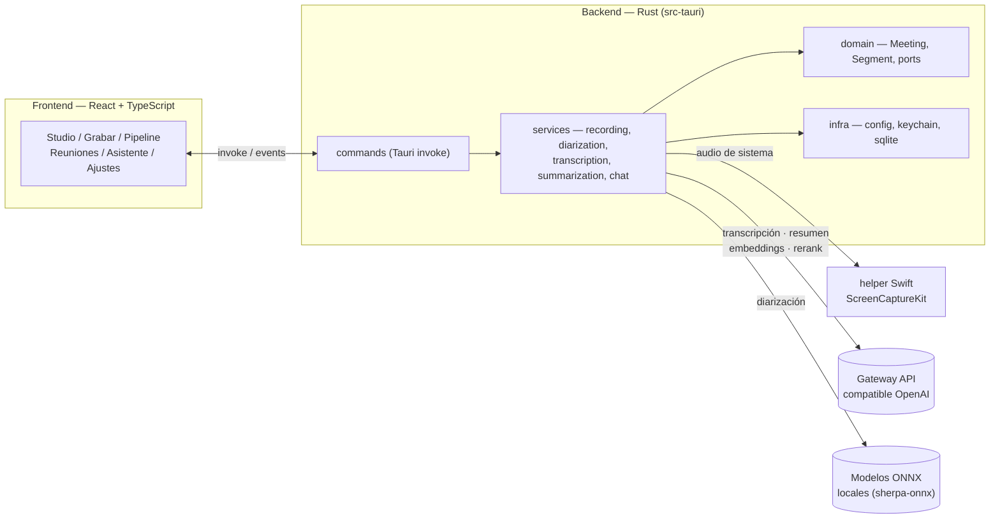

<div align="center">


# Resomer

**Graba, diariza, transcribe y resume tus reuniones — todo en local, todo en macOS.**

[](#requisitos)
[](https://v2.tauri.app)
[](https://react.dev)
[](https://www.rust-lang.org)
[](https://github.com/Angelfonseca/resomer/actions/workflows/build-installer.yml)

</div>

---

## Índice

- [¿Qué es Resomer?](#qué-es-resomer)
- [Características](#características)
- [Arquitectura](#arquitectura)
- [Stack tecnológico](#stack-tecnológico)
- [Requisitos](#requisitos)
- [Puesta en marcha](#puesta-en-marcha)
- [Scripts disponibles](#scripts-disponibles)
- [Configuración](#configuración)
- [Estructura del proyecto](#estructura-del-proyecto)
- [Compilar y distribuir](#compilar-y-distribuir)
- [Privacidad](#privacidad)

---

## ¿Qué es Resomer?

Resomer es una app de escritorio para macOS que convierte una reunión grabada
(por micrófono o audio del sistema) en una transcripción por hablante y un
resumen accionable, con un asistente conversacional para preguntar sobre lo
que se dijo — en esa reunión o en todo tu historial.

El pipeline completo corre en cuatro pasos:

```
🎙️ Grabación  →  🗣️ Diarización  →  📝 Transcripción  →  🧠 Resumen
   (cpal)         (sherpa-onnx,       (Whisper vía        (LLM vía
                    local)              gateway cloud)      gateway cloud)
```

La diarización (separar **quién** habla) corre 100% en el dispositivo con
modelos ONNX; la transcripción y el resumen usan un gateway compatible con la
API de OpenAI. Solo el audio sale del equipo, y únicamente hacia ese gateway.

## Características

- **Grabación dual** — micrófono (cpal) o audio del sistema completo vía
  ScreenCaptureKit, con medidor de nivel en vivo.
- **Diarización local** — segmentación (pyannote) + embeddings de hablante
  (CAM++) con `sherpa-onnx`, sin salir del equipo.
- **Transcripción con timestamps** — Whisper (`verbose_json`) alineado por
  máximo solapamiento con la diarización para producir una tabla de
  utterances por hablante ("quién dijo qué").
- **Resumen automático** — puntos clave y acciones generados por LLM,
  editable desde la propia app.
- **Asistente conversacional** — chat por reunión (contexto = transcripción
  completa) y un asistente global con RAG (embeddings + rerank) sobre todo
  el historial de reuniones.
- **Gestión de reuniones** — buscador, categorías personalizables y estado
  en vivo (`recording` → `processing` → `completed` / `error`) reflejado en
  la barra lateral.
- **Icono de bandeja** — controla la grabación desde la barra de menú de
  macOS incluso con la ventana oculta (el backend sigue grabando aunque
  macOS suspenda el webview).
- **Exportación a PDF** de transcripción y resumen.
- **Clave de API en Keychain** — nunca en disco plano.

## Arquitectura

Resomer es una app **Tauri 2**: un frontend React (todo el estado y la UI) y
un backend Rust (todo lo que toca el sistema — audio, modelos ONNX, SQLite,
Keychain) comunicados por comandos `invoke` y eventos.



El backend sigue una separación por capas (`domain` / `services` / `infra`,
con puertos en `domain::ports`) para poder testear la lógica sin depender de
Tauri, SQLite o red real.

## Stack tecnológico

| Capa | Tecnología |
|---|---|
| Shell de escritorio | [Tauri 2](https://v2.tauri.app) |
| Frontend | React 18 · TypeScript · Vite · Tailwind CSS 4 · Zustand |
| Backend | Rust 2021 · Tokio · Axum-free (comandos Tauri) |
| Audio (micrófono) | `cpal` + `hound` (WAV) |
| Audio (sistema) | Helper nativo en Swift (`ScreenCaptureKit`, `AVFoundation`, compilado por `build.rs`) |
| Diarización | `sherpa-onnx` (pyannote-segmentation-3.0 + CAM++ speaker embeddings) |
| Transcripción / LLM | Gateway HTTP compatible con OpenAI (Whisper, chat completions, embeddings, rerank) |
| Persistencia | SQLite (`rusqlite`, bundled) |
| Secretos | macOS Keychain (`keyring`) |
| Notificaciones | `tauri-plugin-notification` |

## Requisitos

- **macOS 13+** (Ventura o superior) — la app usa `ScreenCaptureKit`, no hay
  soporte Windows/Linux.
- [Xcode Command Line Tools](https://developer.apple.com/xcode/resources/)
  (`swiftc`, necesario para compilar el helper de audio del sistema).
- [Rust](https://rustup.rs) (stable, edición 2021).
- [Node.js 20+](https://nodejs.org) y [pnpm](https://pnpm.io) (`corepack enable`).
- Una API key para el gateway de IA (Whisper + LLM), configurable desde
  **Ajustes** una vez la app está corriendo.

## Puesta en marcha

```bash
# 1. Clonar e instalar dependencias
git clone https://github.com/Angelfonseca/resomer.git
cd resomer
pnpm install

# 2. Descargar los modelos de diarización (~35MB, una sola vez)
./scripts/setup-models.sh

# 3. Levantar la app en modo desarrollo
pnpm tauri dev
```

Al abrir la app por primera vez, ve a **Ajustes** y pega tu API key del
gateway — se guarda cifrada en el Keychain de macOS.

## Scripts disponibles

| Comando | Descripción |
|---|---|
| `pnpm tauri dev` | Levanta la app en modo desarrollo (hot reload). |
| `pnpm build` | Build de producción del frontend + bundle nativo (`tauri build`). |
| `pnpm type-check` | Chequeo de tipos TypeScript sin emitir. |
| `pnpm lint` | ESLint sobre `src/`. |
| `pnpm format` | Formatea `src/` con Prettier. |
| `./scripts/setup-models.sh` | Descarga los modelos ONNX de diarización. |
| `./scripts/check.sh` | Corre `cargo fmt`, `clippy`, build Rust, `type-check` y `lint` — el gate previo a commitear. |
| `./scripts/dev.sh` | Levanta la app, verifica que responde en Vite y la cierra (smoke test de arranque). |

## Configuración

Resomer no requiere un archivo `.env`: la única configuración de usuario es
la API key, guardada en Keychain vía el panel de **Ajustes**. La URL base
del gateway y los timeouts viven en
[`src-tauri/src/infra/config.rs`](src-tauri/src/infra/config.rs) si necesitas
apuntar a otro proveedor compatible con OpenAI.

## Estructura del proyecto

```
resomer/
├── src/                        # Frontend React
│   ├── features/
│   │   ├── recording/          # Grabación (micrófono / sistema)
│   │   ├── pipeline/           # Diarización → transcripción → resumen
│   │   ├── meetings/           # Buscador y estado de reuniones
│   │   ├── chat/                # Asistente por reunión y global
│   │   └── settings/           # API key
│   └── components/              # UI compartida (layout, primitivas)
├── src-tauri/                  # Backend Rust
│   ├── src/
│   │   ├── domain/              # Entidades y puertos (hexagonal)
│   │   ├── services/            # Diarización, transcripción, resumen, chat…
│   │   └── infra/               # Config, Keychain, SQLite
│   ├── helper/main.swift        # Captura de audio del sistema (ScreenCaptureKit)
│   └── build.rs                 # Compila el helper Swift como sidecar
├── scripts/                     # setup-models.sh, check.sh, dev.sh, log.sh
└── .github/workflows/           # CI de build (installer + portable)
```

## Compilar y distribuir

```bash
pnpm build   # equivalente a: pnpm build:frontend && tauri build
```

El CI de GitHub Actions compila para Apple Silicon e Intel de forma nativa
(sin cross-compile, porque el helper Swift se compila para la arquitectura
del runner):

- **[`build-installer.yml`](.github/workflows/build-installer.yml)** — genera
  el `.dmg` instalable.
- **[`build-portable.yml`](.github/workflows/build-portable.yml)** — genera
  el `.app` empaquetado en `.zip`, sin instalador.

Ambos se disparan al pushear un tag `vX.Y.Z` (adjuntan el resultado a un
GitHub Release en borrador) o manualmente desde la pestaña *Actions*. Por
defecto firman con identidad ad-hoc; para builds notarizados con una cuenta
de Apple Developer real, agrega los secretos `APPLE_SIGNING_IDENTITY`,
`APPLE_CERTIFICATE`, `APPLE_CERTIFICATE_PASSWORD`, `APPLE_ID`,
`APPLE_PASSWORD` y `APPLE_TEAM_ID` al repositorio.

## Privacidad

- El audio grabado y los modelos de diarización nunca salen del equipo.
- Solo la transcripción (Whisper) y las llamadas al LLM (resumen, chat,
  embeddings) viajan al gateway configurado, autenticadas con tu API key.
- La API key se guarda en el Keychain de macOS, nunca en texto plano.

---

<div align="center">
<sub>Hecho con Tauri + Rust + React.</sub>
</div>
